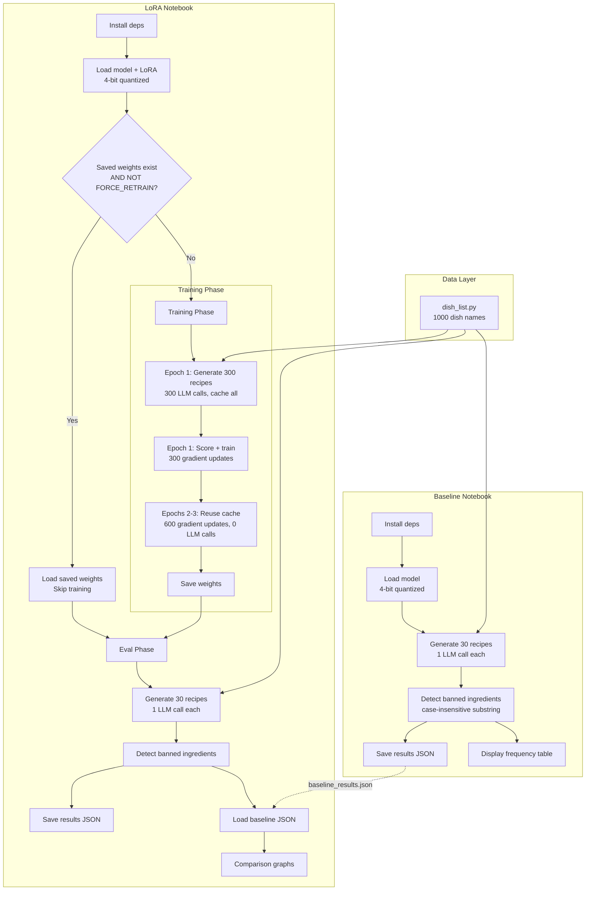

# Design Document: LoRA Ingredient Penalization Experiment

## Overview

This design describes a self-contained Google Colab experiment that compares a baseline Llama 3.1 8B Instruct model against a LoRA-fine-tuned variant trained to avoid banned ingredients. The experiment consists of three deliverables:

1. `dish_list.py` — A Python data file containing 1000 diverse dish names
2. `baseline_ingredient_experiment.ipynb` — Colab notebook that generates 30 recipes with the unmodified base model
3. `lora_ingredient_experiment.ipynb` — Colab notebook that trains LoRA adapters with ingredient penalization (300 training prompts × 3 epochs = 900 gradient updates, 300 LLM calls), evaluates on the same 30 prompts, and produces comparison graphs

The notebooks are intentionally self-contained and do NOT use the existing `run_agent()` pipeline or any of the project's Python modules. Each notebook is a standalone Colab file that installs its own dependencies, loads the model directly, and runs a simple generate → detect → train loop. This keeps the experiment reproducible on any Colab T4 runtime without cloning the full repo.

### Design Rationale

The existing codebase (`local_model.py`) already implements LoRA training via `preference_training_step`, adapter persistence, and 4-bit quantization. The notebooks replicate the relevant subset of this logic inline rather than importing it, because:
- Colab notebooks need to be self-contained (no repo clone required)
- The experiment uses a simpler pipeline (single LLM call per recipe, plain-text output, substring detection) compared to the full agent pipeline (intent parsing, candidate generation, optimization, structured JSON output)
- Keeping the code inline makes the experiment transparent and easy to modify

## Architecture



### File Structure

```
project_root/
├── dish_list.py                          # 1000 dish names, single list variable
├── baseline_ingredient_experiment.ipynb  # Baseline notebook (no training)
└── lora_ingredient_experiment.ipynb      # LoRA notebook (train + eval + graphs)
```

Both notebooks import `dish_list.py` by uploading it to Colab or mounting Google Drive. The dish list is a plain Python file so it can be imported with a simple `from dish_list import DISHES`.

## Components and Interfaces

### 1. Dish List (`dish_list.py`)

A Python module exporting a single variable:

```python
DISHES: list[str]  # exactly 1000 unique dish names
```

The list spans 20+ cuisines (Italian, Japanese, Mexican, Indian, Thai, Chinese, French, Korean, Ethiopian, Moroccan, Peruvian, Turkish, Vietnamese, Greek, Spanish, Lebanese, Brazilian, British, American, German, and more). Dishes range from simple (e.g., "Margherita Pizza") to complex (e.g., "Mole Poblano with Turkey").

### 2. Shared Configuration (defined inline in each notebook)

Both notebooks define these constants in a configuration cell:

```python
# ── Configuration ──────────────────────────────────────────
MODEL_ID = "meta-llama/Meta-Llama-3.1-8B-Instruct"
BANNED_INGREDIENTS = ["garlic", "butter", "heavy cream", "soy sauce", "sugar"]

NUM_TRAINING_PROMPTS = 300   # LoRA notebook only
NUM_EVAL_PROMPTS = 30
NUM_EPOCHS = 3               # LoRA notebook only
TEMPERATURE = 0.8
MAX_TOKENS = 1024

WEIGHT_SAVE_PATH = "/content/drive/MyDrive/lora_weights"  # or "/content/lora_weights"
FORCE_RETRAIN = False        # LoRA notebook only

PROMPT_TEMPLATE = "Write a recipe for {dish}. Include a title, an Ingredients: section listing all ingredients, and step-by-step cooking instructions."
```

### 3. Model Loading (shared pattern, inline in each notebook)

Both notebooks use identical model loading code:

```python
def load_model(model_id: str, hf_token: str):
    """Load Llama 3.1 8B with 4-bit quantization for T4 GPU."""
    from transformers import AutoModelForCausalLM, AutoTokenizer, BitsAndBytesConfig
    import torch

    bnb_config = BitsAndBytesConfig(
        load_in_4bit=True,
        bnb_4bit_compute_dtype=torch.bfloat16,
    )
    tokenizer = AutoTokenizer.from_pretrained(model_id, token=hf_token)
    if tokenizer.pad_token is None:
        tokenizer.pad_token = tokenizer.eos_token

    model = AutoModelForCausalLM.from_pretrained(
        model_id, token=hf_token,
        quantization_config=bnb_config,
        device_map="auto",
    )
    return model, tokenizer
```

The LoRA notebook additionally wraps the model with PEFT:

```python
def apply_lora(model):
    """Apply LoRA adapters targeting q_proj and v_proj."""
    from peft import LoraConfig, get_peft_model, TaskType

    lora_config = LoraConfig(
        task_type=TaskType.CAUSAL_LM,
        r=8,
        lora_alpha=16,
        lora_dropout=0.05,
        target_modules=["q_proj", "v_proj"],
    )
    model = get_peft_model(model, lora_config)
    model.print_trainable_parameters()
    return model
```

### 4. Recipe Generation (shared pattern)

```python
def generate_recipe(model, tokenizer, dish: str, template: str, temperature: float, max_tokens: int) -> str:
    """Generate a single recipe via one LLM call. Returns plain text."""
    prompt = template.format(dish=dish)
    messages = [{"role": "user", "content": prompt}]
    # Use tokenizer.apply_chat_template for proper Llama 3.1 formatting
    input_ids = tokenizer.apply_chat_template(messages, return_tensors="pt").to(model.device)
    outputs = model.generate(
        input_ids,
        max_new_tokens=max_tokens,
        temperature=temperature,
        do_sample=True,
        pad_token_id=tokenizer.eos_token_id,
    )
    # Decode only the new tokens (skip the prompt)
    generated = tokenizer.decode(outputs[0][input_ids.shape[1]:], skip_special_tokens=True)
    return generated
```

### 5. Ingredient Detection (shared pattern)

```python
def detect_banned_ingredients(recipe_text: str, banned: list[str]) -> list[str]:
    """Case-insensitive substring match against full recipe text.
    Returns list of banned ingredients found."""
    text_lower = recipe_text.lower()
    return [ing for ing in banned if ing.lower() in text_lower]
```

### 6. Preference Head (LoRA notebook only)

Replicates the `PreferenceHead` from `local_model.py`:

```python
class PreferenceHead(torch.nn.Module):
    """Scores recipe hidden states → scalar preference score."""
    def __init__(self, hidden_dim: int):
        super().__init__()
        self.proj = torch.nn.Linear(hidden_dim, 128)
        self.act = torch.nn.GELU()
        self.out = torch.nn.Linear(128, 1)

    def forward(self, hidden_state):
        if hidden_state.ndim == 2:
            h = hidden_state.mean(dim=0)
        else:
            h = hidden_state
        return self.out(self.act(self.proj(h))).squeeze()
```

### 7. Training Loop (LoRA notebook only)

The training loop follows a generate-once, train-multi-epoch pattern:

```python
def training_phase(model, tokenizer, pref_head, optimizer, dishes, banned, config):
    """
    Epoch 1: Generate 300 recipes (300 LLM calls), cache them, compute scores, train.
    Epochs 2-3: Reuse cached recipes, recompute scores, train.
    Total: 900 gradient updates, 300 LLM calls.
    """
    cache = {}  # dish -> recipe_text

    for epoch in range(config.num_epochs):
        for i, dish in enumerate(dishes):
            # Generate or reuse
            if epoch == 0:
                recipe_text = generate_recipe(model, tokenizer, dish, ...)
                cache[dish] = recipe_text
            else:
                recipe_text = cache[dish]

            # Compute penalization signal
            found = detect_banned_ingredients(recipe_text, banned)
            signal = 0.0 if found else 1.0

            # Forward pass for hidden states
            inputs = tokenizer(recipe_text, return_tensors="pt", truncation=True, max_length=512)
            inputs = {k: v.to(model.device) for k, v in inputs.items()}
            outputs = model(**inputs, output_hidden_states=True)
            hidden = outputs.hidden_states[-1].squeeze(0).mean(dim=0)

            # Preference head prediction + MSE loss
            predicted = pref_head(hidden)
            target = torch.tensor(signal, dtype=torch.float32, device=model.device)
            loss = torch.nn.functional.mse_loss(predicted, target)

            optimizer.zero_grad()
            loss.backward()
            optimizer.step()

    return cache
```

### 8. Comparison Graph Generation (LoRA notebook only)

```python
def plot_comparison(baseline_results: dict, lora_results: dict, banned: list[str]):
    """Generate grouped bar chart + summary bar chart."""
    # Chart 1: Per-ingredient grouped bars
    # Chart 2: Total banned appearances (baseline vs LoRA)
    # Both use matplotlib with labeled axes, legend, clear titles
```

### 9. Weight Persistence (LoRA notebook only)

```python
def save_weights(model, pref_head, path: str):
    """Save LoRA adapters via PEFT + preference head state dict."""
    model.save_pretrained(os.path.join(path, "lora"))
    torch.save(pref_head.state_dict(), os.path.join(path, "preference_head.pt"))

def load_weights(model, pref_head, path: str) -> bool:
    """Load saved weights. Returns True if loaded, False if not found."""
    lora_path = os.path.join(path, "lora")
    pref_path = os.path.join(path, "preference_head.pt")
    if os.path.exists(lora_path) and os.path.exists(pref_path):
        from peft import PeftModel
        model = PeftModel.from_pretrained(model, lora_path)
        pref_head.load_state_dict(torch.load(pref_path, map_location=model.device))
        return True
    return False
```

## Data Models

### Results JSON Schema

Both notebooks write a JSON file with this structure:

```json
{
  "metadata": {
    "notebook": "baseline" | "lora",
    "model_id": "meta-llama/Meta-Llama-3.1-8B-Instruct",
    "banned_ingredients": ["garlic", "butter", "heavy cream", "soy sauce", "sugar"],
    "num_eval_prompts": 30,
    "timestamp": "2025-01-15T10:30:00"
  },
  "recipes": [
    {
      "dish": "Pad Thai",
      "recipe_text": "...(full plain-text recipe)...",
      "banned_found": ["garlic", "soy sauce"],
      "contains_banned": true
    }
  ],
  "summary": {
    "total_recipes": 30,
    "recipes_with_banned": 18,
    "recipes_clean": 12,
    "per_ingredient_count": {
      "garlic": 15,
      "butter": 8,
      "heavy cream": 3,
      "soy sauce": 10,
      "sugar": 12
    }
  }
}
```

### Prompt Selection

Prompts are drawn from `DISHES` by index:
- Training prompts: `DISHES[0:300]` (first 300 dishes)
- Eval prompts: `DISHES[300:330]` (next 30 dishes, non-overlapping)

Both notebooks use the same eval indices to ensure identical evaluation sets.

### Weight Storage Layout

```
{WEIGHT_SAVE_PATH}/
├── lora/
│   ├── adapter_config.json
│   ├── adapter_model.safetensors
│   └── ...
└── preference_head.pt
```


## Correctness Properties

*A property is a characteristic or behavior that should hold true across all valid executions of a system — essentially, a formal statement about what the system should do. Properties serve as the bridge between human-readable specifications and machine-verifiable correctness guarantees.*

The following properties were derived from the acceptance criteria across all 9 requirements. Many criteria (especially detection logic repeated across both notebooks) map to the same underlying property. After deduplication, 7 unique properties remain.

### Property 1: Banned ingredient detection correctness

*For any* recipe text string and *for any* list of banned ingredient strings, `detect_banned_ingredients(text, banned)` should return exactly those banned ingredients whose lowercased form appears as a substring in the lowercased recipe text. This must hold regardless of the casing of the recipe text or the banned ingredient strings, and regardless of where in the text the ingredient appears (title, ingredients section, or instructions).

**Validates: Requirements 2.7, 3.5, 3.10, 9.3, 9.4, 9.5, 9.6**

### Property 2: Penalization signal is binary and correct

*For any* recipe text and *for any* list of banned ingredients, the penalization signal should be exactly 0.0 if `detect_banned_ingredients` returns a non-empty list, and exactly 1.0 if it returns an empty list. There are no other possible values.

**Validates: Requirements 3.5**

### Property 3: Per-ingredient frequency aggregation

*For any* list of recipe results where each result contains a `banned_found` list, the computed `per_ingredient_count` for each banned ingredient should equal the number of recipes in which that ingredient appears in `banned_found`. The `recipes_with_banned` count should equal the number of recipes where `banned_found` is non-empty.

**Validates: Requirements 2.8, 3.11**

### Property 4: Results JSON round-trip

*For any* valid results dictionary (containing metadata, a list of recipe results, and a summary), serializing it with `json.dump` and then deserializing with `json.load` should produce a dictionary equal to the original.

**Validates: Requirements 2.9, 3.12, 9.7**

### Property 5: Training loop counting invariant

*For any* number of training prompts N and number of epochs E, the training loop should perform exactly N × E gradient updates total, and exactly N LLM calls (all during epoch 1). For epochs 2 through E, the loop should reuse cached recipes with zero additional LLM calls.

**Validates: Requirements 3.4, 3.7, 3.8**

### Property 6: Prompt template preserves dish name

*For any* dish name string, formatting it into the prompt template should produce a string that contains the original dish name as a substring.

**Validates: Requirements 8.1**

### Property 7: Training and evaluation sets are disjoint

*For any* dish list of length ≥ 330, the set of dishes used for training (indices 0–299) and the set used for evaluation (indices 300–329) should have zero intersection.

**Validates: Requirements 8.3**

## Error Handling

### Model Loading Failures
- If the HF token is missing or invalid, the notebook should fail fast with a clear error message before attempting model download.
- If CUDA/T4 is not available, the notebook should detect this in the first cell and warn the user to switch runtime.

### Generation Failures
- If `model.generate()` produces an empty or truncated response, the recipe should be logged with an empty `banned_found` list and flagged in the results JSON.
- The notebooks should not retry failed generations — each dish gets exactly one LLM call. A failed generation counts as a recipe with no banned ingredients detected (conservative: does not inflate the banned count).

### Weight Persistence Failures
- If Google Drive is not mounted and `WEIGHT_SAVE_PATH` points to Drive, the save operation should catch the `FileNotFoundError` and print a warning suggesting the user mount Drive or use a local path.
- If saved weights are corrupted (e.g., incomplete save), `load_weights` should catch the exception, print a warning, and fall through to full training.

### JSON I/O Failures
- If the baseline results JSON is missing when the LoRA notebook tries to load it for comparison, the notebook should skip graph generation and print a message telling the user to run the baseline notebook first.

## Testing Strategy

### Dual Testing Approach

This experiment uses both unit tests and property-based tests:

- **Unit tests**: Verify specific examples, edge cases, and integration points (e.g., prompt template contains expected keywords, default banned list has ≥ 5 items, notebook structure checks)
- **Property-based tests**: Verify universal properties across randomly generated inputs (e.g., detection correctness for arbitrary text/ingredient combinations, frequency aggregation for arbitrary result lists)

### Property-Based Testing Configuration

- **Library**: [Hypothesis](https://hypothesis.readthedocs.io/) for Python
- **Minimum iterations**: 100 per property test (via `@settings(max_examples=100)`)
- **Tag format**: Each test is annotated with a comment referencing the design property:
  ```python
  # Feature: lora-ingredient-penalization-experiment, Property 1: Banned ingredient detection correctness
  ```

### Test Plan

| Property | Test Type | What It Validates |
|----------|-----------|-------------------|
| Property 1: Detection correctness | Property-based | Generate random text with random ingredient substrings inserted; verify detection finds exactly the inserted ones |
| Property 2: Penalization signal | Property-based | Generate random detection results; verify signal is 0.0 iff non-empty, 1.0 iff empty |
| Property 3: Frequency aggregation | Property-based | Generate random lists of recipe results with random `banned_found` lists; verify counts match |
| Property 4: JSON round-trip | Property-based | Generate random results dicts; verify `json.loads(json.dumps(x)) == x` |
| Property 5: Training loop counting | Property-based | Generate random N (prompts) and E (epochs); simulate the loop with a mock model; count gradient updates and LLM calls |
| Property 6: Prompt preserves dish name | Property-based | Generate random dish name strings; verify formatted prompt contains the name |
| Property 7: Disjoint train/eval sets | Property-based | Generate random dish lists of length ≥ 330; verify `set(lst[0:300]) & set(lst[300:330]) == set()` |

### Unit Test Examples

- Verify `DISHES` has exactly 1000 elements and all are unique
- Verify the prompt template contains "Ingredients:" and does not contain "JSON"
- Verify `BANNED_INGREDIENTS` default list has ≥ 5 items
- Verify `detect_banned_ingredients("Garlic bread with BUTTER", ["garlic", "butter"])` returns `["garlic", "butter"]`
- Verify `detect_banned_ingredients("Plain rice", ["garlic"])` returns `[]`
- Verify weight save/load round-trip (mock filesystem)
- Verify FORCE_RETRAIN=True bypasses weight loading
